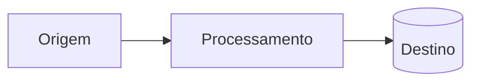

# Parte NN — <Título da parte>

> Resumo de estudos da trilha *Data Engineering on Google Cloud*.
> Foco: <uma linha sobre o tema desta parte>.

## Sumário

1. [<Seção 1>](#1-seção-1)
2. [<Seção 2>](#2-seção-2)
<!-- ...adicione as seções necessárias... -->
N. [Cheat sheet de decisão](#n-cheat-sheet-de-decisão)
N+1. [Perguntas de prática](#n1-perguntas-de-prática)

---

## 1. <Seção 1>

<Conceitos-chave em texto curto.>

<!-- Use tabelas de decisão sempre que houver "quando usar cada serviço": -->

| Serviço | Uso ideal | Observações |
|---------|-----------|-------------|
| | | |

<!-- Use diagramas Mermaid para fluxos/arquiteturas (renderizam nativo no GitHub): -->

---

## N. Cheat sheet de decisão

**<Cenário> →**
- <condição> → <serviço>

---

## N+1. Perguntas de prática

> Baseadas nos quizzes dos módulos. Tente responder antes de expandir o gabarito.

1. <Pergunta>
   

Resposta
<resposta>

---

### Laboratórios praticados

`GSP____` · *<nome do lab>*
