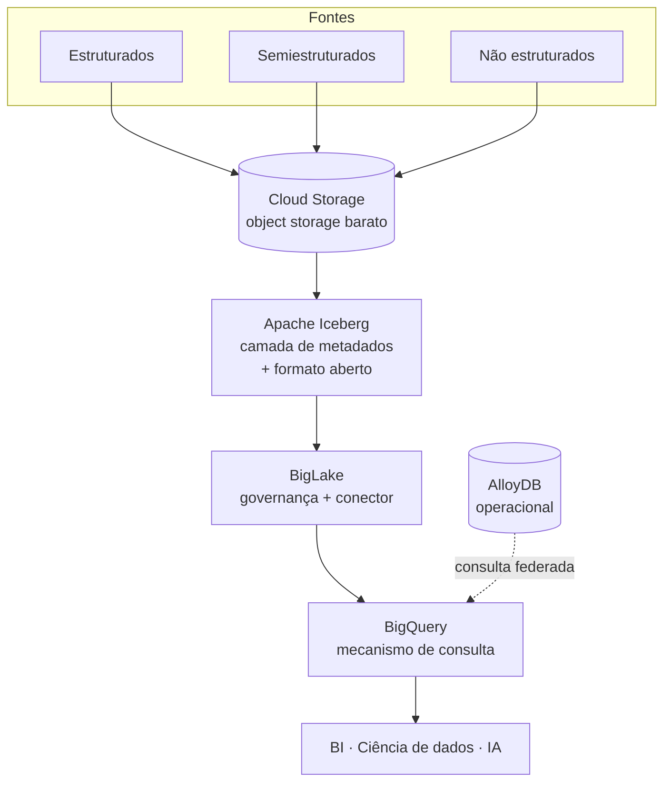
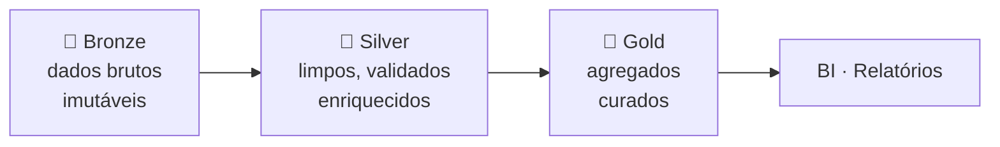

# Parte 2 — Construa Data Lakes e Data Warehouses no Google Cloud

> Resumo de estudos da trilha *Data Engineering on Google Cloud*.
> Foco: arquitetura **data lakehouse** — unificar data lake e data warehouse com Cloud Storage,
> formatos abertos (Apache Iceberg), BigQuery e BigLake, com governança e ML.

## Sumário

1. [Data lake, data warehouse e lakehouse](#1-data-lake-data-warehouse-e-lakehouse)
2. [Armazenamento: Cloud Storage como base](#2-armazenamento-cloud-storage-como-base)
3. [Apache Iceberg: formato de tabela aberta](#3-apache-iceberg-formato-de-tabela-aberta)
4. [BigQuery como mecanismo central](#4-bigquery-como-mecanismo-central)
5. [AlloyDB e dados operacionais](#5-alloydb-e-dados-operacionais)
6. [Consultas federadas](#6-consultas-federadas)
7. [Arquitetura interna do BigQuery](#7-arquitetura-interna-do-bigquery)
8. [Particionamento e clustering](#8-particionamento-e-clustering)
9. [BigLake e tabelas externas](#9-biglake-e-tabelas-externas)
10. [Governança e segurança](#10-governança-e-segurança)
11. [Machine learning no lakehouse](#11-machine-learning-no-lakehouse)
12. [Arquitetura medallion e migração](#12-arquitetura-medallion-e-migração)
13. [Custos, práticas recomendadas e armadilhas](#13-custos-práticas-recomendadas-e-armadilhas)
14. [Cheat sheet de decisão](#14-cheat-sheet-de-decisão)
15. [Perguntas de prática](#15-perguntas-de-prática)

---

## 1. Data lake, data warehouse e lakehouse

### Os clássicos

| | **Data Lake** | **Data Warehouse** |
|--|--------------|--------------------|
| **Premissa** | "Armazene tudo agora, descubra o uso depois" | "Estrutura e qualidade primeiro" |
| **Esquema** | **schema-on-read** (na leitura) | **schema-on-write** (na gravação) |
| **Dados** | Brutos, formato nativo: estrut./semi/não estruturados | Limpos, transformados, estruturados |
| **Ideal para** | Exploração, ML/IA, big data | BI, relatórios, dashboards |
| **Exemplo GCP** | Cloud Storage | BigQuery |

**Vantagens do data lake:** flexibilidade (todos os tipos), agilidade (ingestão rápida), escalabilidade (até exabytes), custo-benefício (object storage barato), suporte a IA/ML.
**Desvantagens:** risco de virar **"pântano de dados"** sem governança, complexidade de gerenciamento, análise demorada (precisa preparar antes), riscos de segurança com dado bruto.

**Vantagens do data warehouse:** velocidade (consultas otimizadas), dados de alta qualidade, foco no negócio, inteligência histórica.
**Desvantagens:** **inflexibilidade** (não acomoda facilmente novos tipos ou dado não estruturado), custo, tipos de dados limitados, longo tempo de desenvolvimento.

### A abordagem moderna: data lakehouse

Combina a **flexibilidade e o baixo custo do lake** com a **velocidade e a precisão do warehouse**,
numa plataforma única que suporta BI, ciência de dados e IA **sem mover ou duplicar dados**.

> 🔑 **Como funciona:** implementa uma **camada de metadados e governança sobre arquivos em
> formato aberto** armazenados em object storage de baixo custo (Cloud Storage).



**Recursos-chave do lakehouse no GCP:** suporte à maioria dos formatos · esquema flexível (on-read ou on-write) · acesso a todos os tipos de usuário · flexibilidade de custo · **governança unificada** · **transações ACID**.

**Benefícios:** reduz redundância · governança unificada · **quebra silos de dados** · flexibilidade e escalabilidade.

### Escolhendo a arquitetura

| Necessidade | Escolha |
|-------------|---------|
| BI interativo de alta velocidade em dados estruturados | **Data warehouse** (BigQuery) |
| Armazenamento inicial barato de volume massivo bruto; uso final indefinido | **Data lake** (Cloud Storage) |
| Fazer **tudo**: BI + IA + ciência de dados numa **única cópia governada** | **Data lakehouse** (BigQuery + BigLake) |

---

## 2. Armazenamento: Cloud Storage como base

O **Cloud Storage** é o armazenamento principal do lakehouse: object storage durável, econômico e escalável.
Guarda quase qualquer tipo de arquivo, de qualquer tamanho ou formato. Não é obrigatório — numa
estratégia **multicloud**, os dados podem ficar no object storage de outro provedor.

### Dados multimodais

| Tipo | Definição | Exemplos |
|------|-----------|----------|
| **Estruturados** | Formato predefinido, linhas/colunas | Clientes, catálogo de produtos, transações |
| **Semiestruturados** | Sem modelo rígido, mas com tags/marcadores de hierarquia | JSON de pedidos, logs de servidor web |
| **Não estruturados** | Sem estrutura organizacional predefinida | Avaliações em texto, chats de suporte, imagens |

> Permite armazenar dado bruto **como chega**, sem definir estrutura antecipadamente (schema-on-read).

---

## 3. Apache Iceberg: formato de tabela aberta

O Cloud Storage é ótimo para arquivos brutos, mas o lakehouse precisa de **estrutura e desempenho**.
É aí que entram os formatos de tabela aberta — o **Apache Iceberg** é o líder.

> 🔑 O Iceberg **não move os dados**: adiciona uma **camada de metadados e estrutura** sobre os
> arquivos no Cloud Storage, agindo como **índice e catálogo**.

| Recurso | O que faz |
|---------|-----------|
| **Evolução de esquema** | Adicionar/renomear colunas sem quebrar dados ou aplicativos existentes |
| **Particionamento oculto** | Gerencia o particionamento automaticamente; o analista não se preocupa com a organização dos arquivos |
| **Time travel** | Consultar **versões passadas** dos dados — essencial para auditoria e depuração |
| **Transações atômicas** | Operações confiáveis e simultâneas, sem corrupção |

Resultado: tratar uma coleção de arquivos como **tabelas performáticas e consultáveis** — os benefícios do warehouse dentro do lake.

---

## 4. BigQuery como mecanismo central

O BigQuery é o **mecanismo de análise e consulta** do lakehouse.

- Consulta **direta e segura** os dados em Iceberg no Cloud Storage via SQL familiar (tabelas de lakehouse).
- **Sem duplicar dados** e sem ETL caro para analisar.
- Também oferece **armazenamento nativo otimizado** — ideal para dados "quentes" (mais acessados) que exigem a consulta mais rápida.
- Plataforma unificada: analisa dados no lake, no armazenamento nativo, ou em ambos — por uma única interface.

---

## 5. AlloyDB e dados operacionais

Dados **operacionais** (tempo real, em constante mudança) exigem solução diferente da analítica:
processamento de pedidos, gerenciamento de inventário, login de usuários.

Esses casos exigem **alto volume transacional**, **latência baixíssima** e **consistência forte** —
bancos analíticos não são projetados para isso.

**AlloyDB for PostgreSQL** — banco gerenciado compatível com PostgreSQL para cargas OLTP exigentes:

| Vantagem | Detalhe |
|----------|---------|
| **Alto desempenho** | Significativamente mais rápido que o PostgreSQL padrão |
| **Alta disponibilidade** | Resiliente; operações principais sempre online |
| **Compatibilidade PostgreSQL** | Aproveita habilidades/ferramentas existentes; facilita migração |

---

## 6. Consultas federadas

Permitem ao BigQuery consultar sistemas externos (como o AlloyDB) **em tempo real, sem mover ou copiar dados** —
criando a ponte entre o **operacional em tempo real** e o **analítico histórico**.

**Como usar:**
1. Um administrador cria um recurso de **conexão segura** no BigQuery (credenciais + configuração). Configuração **única**.
2. O analista usa a função SQL **`EXTERNAL_QUERY`**, que recebe dois argumentos: o **ID da conexão** e a **consulta** a executar no banco externo.

---

## 7. Arquitetura interna do BigQuery

**Totalmente gerenciado:** o Google cuida de hardware, rede, patches, atualizações e falhas.
**Sem servidor:** não provisiona nem gerencia servidores; carrega e consulta. Aloca recursos automaticamente e escala conforme a complexidade.

### Separação entre armazenamento e computação

> Analogia: os **livros** são os dados (armazenados no sistema de arquivos distribuído); os
> **bibliotecários** são a computação. O BigQuery aciona milhares deles ao mesmo tempo.

Escalam de forma **independente**: mais dados → mais armazenamento automaticamente; consultas complexas → mais computação, **pagando só enquanto a consulta roda**. É a chave para gerenciar custo e desempenho.

| Conceito | O que é |
|----------|---------|
| **Dremel** | Mecanismo de processamento distribuído que executa as consultas |
| **Slot** | **Worker virtual** — unidade independente de computação (CPU + RAM + rede). Milhares por job = *processamento paralelo massivo* |
| **Shuffle (redistribuição)** | Redistribui os dados intermediários entre fases (`GROUP BY`, `JOIN`), usando a rede interna de petabits **Jupiter** |
| **Colossus** | Sistema de arquivos onde ficam os arquivos colunares das tabelas nativas |

### Como o Dremel lê cada fonte

| Fonte | Como funciona |
|-------|---------------|
| **Tabelas nativas** | Dremel lê direto os arquivos colunares otimizados no **Colossus** |
| **Iceberg no Cloud Storage** | **BigLake** atua como ponte: instrui o Dremel a ler o dado do lake como se fosse nativo |
| **Bancos externos (AlloyDB)** | **Consulta federada**: o Dremel "empurra" partes da consulta ao banco, que executa e devolve só os resultados |

> Essa arquitetura desacoplada transforma o BigQuery de simples data warehouse em **mecanismo de
> análise unificado** — uma única query SQL combinando warehouse + lake + banco operacional.

---

## 8. Particionamento e clustering

Duas técnicas para consultas mais rápidas e baratas. **Princípio comum: usar metadados para ignorar dados desnecessários.**

### Particionamento

> Analogia: **divisórias num arquivo** — em vez de uma gaveta gigante, seções por ano/mês/dia.

- Particiona por coluna de **data** ou de **número inteiro**.
- Filtrando por data, o BigQuery lê **só as partições relevantes** e ignora as demais → menos dados verificados, consulta mais rápida e barata.

### Clustering

> Analogia: dentro de cada gaveta, **ordenar os arquivos** alfabeticamente por nome do cliente.

- Organiza os dados **dentro** de cada partição (ex.: por `customer_id` ou `product_category`).
- O BigQuery vai à partição certa e **pula direto** para o dado do cliente, em vez de ler a partição inteira.

```sql
SELECT *
FROM cymbal_sales
WHERE transaction_date = '2025-08-01'   -- usa o particionamento
  AND customer_id = 'CUST003';          -- usa o clustering
```

### Em tabelas Iceberg

O BigQuery **não implementa** o próprio particionamento/clustering — ele **aproveita os metadados do Iceberg**:

| Mecanismo | Como funciona |
|-----------|---------------|
| **Particionamento** | Definido/gravado por um motor como o **Spark**. Os metadados rastreiam quais arquivos pertencem a qual data. O BigQuery (via BigLake) lê os metadados, identifica os arquivos da data e **elimina os demais** |
| **Clustering** | Espelhado pela **classificação e estatísticas no nível do arquivo**. Os metadados guardam **min/max** por coluna em cada arquivo |
| **Pushdown de predicado** | O planejador consulta essas estatísticas e **pula arquivos** cujo intervalo min/max não contém o valor buscado — mesmo dentro da partição correta |

---

## 9. BigLake e tabelas externas

### O problema

A separação lake/warehouse cria **silos**, exige **pipelines ETL** para mover/duplicar (latência + custo)
e dificulta a **governança** (políticas em dois sistemas).

### A solução

O **BigLake** é um **mecanismo de armazenamento e conector** que estende os recursos do BigQuery
ao object storage. Cria **tabelas externas**: tabelas no BigQuery que **não contêm os dados**, apenas
**apontam** para os arquivos no lake.

> Exemplo: logs JSON brutos no Cloud Storage → cria-se uma tabela externa BigLake sobre eles →
> consulta-se via SQL instantaneamente, e até faz `JOIN` com tabela nativa — **sem mover nem duplicar**.

### Governança e delegação de acesso

🔑 **O recurso mais poderoso do BigLake:**

- Ao criar a tabela BigLake, você a associa a uma **conta de serviço** com permissão de ler o Cloud Storage.
- O usuário final precisa de permissão **só na tabela do BigQuery**, **não no bucket**.
- Permite **segurança em nível de linha e coluna** + **mascaramento dinâmico**.
- Resultado: o analista vê só as colunas liberadas (ex.: `product_page_url`), com PII mascarada (ex.: `ip_address`), e **não consegue burlar** os controles acessando os arquivos brutos.

### Padrões abertos + Iceberg

- Padrões abertos evitam **dependência de fornecedor** e garantem interoperabilidade.
- BigQuery + BigLake têm **suporte nativo de primeira classe** ao Iceberg: o Spark grava em Iceberg no lake → registra-se a tabela no BigLake → fica **instantaneamente disponível** para consulta de alto desempenho.
- **Além do somente leitura:** dá para rodar **`UPDATE`, `DELETE` e `MERGE`** direto do BigQuery em tabelas Iceberg — útil para correções e **direito ao esquecimento** com SQL padrão.

---

## 10. Governança e segurança

### Dataplex — o hub de metadados

**Metadados** = dados sobre dados: quem criou, quando, o que contêm, como se relacionam, quem é o dono, e a **sensibilidade de segurança**.

- Fornece um **hub de metadados unificado** / **catálogo universal** para todos os recursos — BigQuery, Cloud Storage e BigLake.
- Usado para **descobrir dados**, entender **linhagem** e gerenciar/aumentar metadados.
- Também é descrito como uma **malha de dados inteligente**; aplica regras de qualidade e políticas de segurança.

### Proteção de Dados Sensíveis

Três funções principais — **Descoberta → Classificação → Proteção**:

| Função | O que faz |
|--------|-----------|
| **Descoberta** | Verifica tabelas do BigQuery e buckets do Cloud Storage buscando padrões (cartão de crédito, e-mail...) |
| **Classificação** | Classifica por **nível de sensibilidade** para aplicar os controles corretos |
| **Proteção** | **Mascaramento** ou **tokenização** para desidentificar (ex.: mostrar só os 4 últimos dígitos) |

> 💡 **Tokenização com hash criptográfico** mantém a **integridade referencial**: o mesmo e-mail vira
> sempre o mesmo token → permite contar clientes únicos **sem expor PII**.

### IAM — princípio do privilégio mínimo

| Serviço | Prática recomendada |
|---------|---------------------|
| **Cloud Storage** | Acesso no nível do **bucket**; restrito a engenheiros e contas de serviço de ingestão |
| **BigQuery** | IAM granular por **dataset/tabela**. Analistas: leitura de dados selecionados. Cientistas: criar/modificar em **sandbox** |
| **BigLake** | Estende a segurança detalhada do BigQuery aos dados do Cloud Storage |

**Segurança refinada:**
- **Nível de coluna** — restringe colunas específicas (ex.: analista vê histórico de compras, mas não o contato) → ideal para **PII**.
- **Nível de linha** — filtra as linhas visíveis (ex.: gerente regional vê só a própria região).

---

## 11. Machine learning no lakehouse

Tradicionalmente, ML exigia **mover dados** para outro ambiente — lento, caro e gerava silos. No lakehouse, o ML roda **direto nos dados**.

### BigQuery ML — ML para analistas

Cria e implanta modelos com **SQL simples** — não precisa ser especialista em Python ou TensorFlow.

Fluxo típico (ex.: prever **churn** de clientes):

1. **Engenharia de atributos** — SQL cria os sinais: `recency` (dias desde a última compra), `frequency` (compras no ano), `monetary_value` (total gasto), `days_since_first_purchase`.
2. **Treinamento** — uma única instrução **`CREATE MODEL`**. Para classificação binária, regressão logística ou árvore otimizada:

```sql
CREATE OR REPLACE MODEL cymbal_ecommerce.customer_churn_predictor
OPTIONS(model_type='LOGISTIC_REG') AS
SELECT
  customer_id, recency, frequency, monetary_value,
  (total_purchases > 1) AS will_return   -- label
FROM cymbal_ecommerce.customer_purchase_summary;
```

3. **Avaliação** — **`ML.EVALUATE`** retorna acurácia, precisão, recall.
4. **Previsão** — **`ML.PREDICT`** gera a probabilidade por cliente → alimenta campanhas segmentadas.

### Vertex AI — ML avançado

Plataforma completa para criar, implantar e gerenciar modelos, **integrada ao BigQuery**:

| Etapa | O que acontece |
|-------|----------------|
| **Preparação** | Análise no BigQuery, com notebooks (Vertex AI Notebooks) em Python/SQL |
| **Treinamento** | Modelo customizado (TensorFlow/PyTorch) via **Vertex AI Training**; lê **direto do BigQuery**, sem extração manual |
| **Registro e deploy** | **Model Registry** versiona; deploy num **endpoint** → API REST para recomendações em tempo real |
| **MLOps** | Pipelines de **retreino automático** e monitoramento (ex.: **desvio de previsão**) |

---

## 12. Arquitetura medallion e migração

### As três zonas



| Zona | Conteúdo | Onde fica |
|------|----------|-----------|
| **Bronze** (bruta) | Zona de destino de tudo: clickstream via **Pub/Sub** → Cloud Storage, exportações em lote (CSV/Avro), JSON de campanhas. **Imutável** — registro histórico do que foi recebido | Cloud Storage |
| **Silver** (limpa/conforme) | Limpeza, validação, enriquecimento: parse de clickstream em sessões, join com dimensões de cliente, padronização de datas | Formato aberto (**Parquet**) ou **tabelas BigLake** — ainda no Cloud Storage |
| **Gold** (curada) | Agregados e otimizados para análise: vendas diárias, visão 360° do cliente, resumos de inventário. **Fonte única da verdade** | Quase sempre **tabelas nativas do BigQuery** (máximo desempenho) |

### Estratégia de migração

> Migração completa e única é **arriscada e disruptiva**. Prefira abordagem **gradual e orientada por casos de uso**.

1. **Estabeleça a base** — projeto GCP com IAM/rede, buckets para Bronze/Silver/Gold, Dataplex para metadados e governança.
2. **Comece com um caso de uso de alto impacto** — ex.: análise de marketing (onde combinar estruturado + não estruturado gera muito valor).
3. **Migre os dados** — **BigQuery Data Transfer Service** para transferências recorrentes do warehouse on-prem; **Dataflow** para ingerir clickstream em tempo real na zona Bronze.
4. **Crie novos pipelines e relatórios** — popular Silver e Gold; dashboards no **Looker** apontando para as tabelas Gold.
5. **Desative e itere** — após aprovação dos usuários, desligue os relatórios antigos. Demonstra valor e cria impulso para a próxima fase.

---

## 13. Custos, práticas recomendadas e armadilhas

### Otimização de custos

1. **Classe de armazenamento certa** — dado bruto da Bronze, acessado com pouca frequência → **Nearline** ou **Coldline**.
2. **Otimize as consultas** — treine analistas em SQL eficiente; o BigQuery **estima o custo antes** de executar; use **particionamento e clustering**.
3. **Preço fixo (flat-rate)** — para cargas previsíveis, comprar capacidade dedicada a custo mensal fixo em vez de sob demanda.
4. **Orçamentos e alertas** — no console de faturamento, definir budgets e alertas ao se aproximar dos limites.

### Práticas recomendadas

| # | Prática |
|---|---------|
| 1 | **Adote padrões abertos** — Iceberg e Parquet evitam vendor lock-in |
| 2 | **Governe desde o início** — Dataplex para qualidade, segurança e conformidade |
| 3 | **Otimize custo e desempenho** — aproveite a separação storage/compute; particione e clusterize |
| 4 | **Automatize os pipelines** — Dataflow e Dataproc para ingestão e transformação escaláveis |

### Armadilhas comuns

| Armadilha | Risco |
|-----------|-------|
| **Negligenciar a governança** | O lake vira **"pântano de dados"** — difícil achar, confiar e usar |
| **Ignorar a qualidade** | Análises imprecisas → decisões equivocadas. Faça checks em **todas as etapas** |
| **Dependência de fornecedor** | Formatos proprietários limitam flexibilidade futura |
| **Falta de estratégia clara** | Construir sem entender as metas de negócio |

### O futuro: dados + IA

BigQuery ML para análise avançada rápida; Vertex AI para modelos custom (recomendação, detecção de fraude em tempo real). A **IA generativa** abre novas possibilidades: gerar descrições de produtos automaticamente, chatbots de suporte personalizado.

---

## 14. Cheat sheet de decisão

**Escolher arquitetura →**
- BI rápido em dado estruturado → **Data warehouse** (BigQuery)
- Volume bruto barato, uso indefinido → **Data lake** (Cloud Storage)
- BI + IA + ciência de dados numa cópia governada → **Lakehouse** (BigQuery + BigLake)

**Escolher armazenamento →**
- Object storage p/ qualquer formato → **Cloud Storage**
- Estrutura + ACID + time travel sobre arquivos → **Apache Iceberg**
- OLTP, tempo real, baixa latência → **AlloyDB**
- Dado "quente", consulta mais rápida → **armazenamento nativo do BigQuery**

**Consultar dados externos →**
- Arquivos no Cloud Storage / multicloud → **BigLake (tabelas externas)**
- Banco operacional (AlloyDB) em tempo real → **consulta federada** (`EXTERNAL_QUERY`)

**Otimizar consulta →**
- Filtro por data/inteiro → **particionamento**
- Filtro por alta cardinalidade dentro da partição → **clustering**
- Em Iceberg → metadados + **pushdown de predicado** (min/max por arquivo)

**Governar e proteger →**
- Catálogo, descoberta, linhagem → **Dataplex**
- Achar/classificar/proteger PII → **Proteção de Dados Sensíveis**
- Esconder colunas (PII) → **segurança em nível de coluna**
- Filtrar linhas por região/perfil → **segurança em nível de linha**
- Manter contagem única sem expor PII → **tokenização com hash**

**Fazer ML →**
- Analista, SQL, caso comum (churn) → **BigQuery ML** (`CREATE MODEL`)
- Modelo custom, MLOps, endpoint → **Vertex AI**

---

## 15. Perguntas de prática

> Baseadas nos quizzes dos módulos. Tente responder antes de expandir o gabarito.

**Conceitos: lake, warehouse e lakehouse**

1. Qual é a principal desvantagem de um data warehouse tradicional?
   <details><summary>Resposta</summary>É inflexível — não acomoda facilmente novos tipos de dados nem dados não estruturados.</details>
2. Como o lakehouse combina os melhores recursos de lakes e warehouses?
   <details><summary>Resposta</summary>Implementando uma camada de metadados e governança sobre arquivos de formato aberto em object storage de baixo custo.</details>
3. Qual característica define melhor um data lake?
   <details><summary>Resposta</summary>Armazena dados brutos no formato nativo com schema-on-read, ideal para exploração e ML.</details>
4. Empresa precisa suportar BI, ciência de dados e IA numa única cópia governada, eliminando silos. Qual arquitetura?
   <details><summary>Resposta</summary>Data lakehouse com BigQuery + BigLake.</details>

**Componentes do lakehouse**

5. Qual serviço é o principal object storage econômico do lakehouse?
   <details><summary>Resposta</summary>Cloud Storage.</details>
6. Qual o papel principal do Apache Iceberg?
   <details><summary>Resposta</summary>Adiciona uma camada de metadados sobre arquivos no Cloud Storage, habilitando evolução de esquema, time travel e consultas eficientes.</details>
7. Qual caso de uso é mais adequado ao AlloyDB?
   <details><summary>Resposta</summary>Processamento de pedidos em tempo real e atualização de inventário (OLTP de alta transação).</details>
8. Como o BigQuery permite uma plataforma de análise unificada?
   <details><summary>Resposta</summary>Com consultas federadas — analisa dados direto em fontes externas (AlloyDB, Iceberg no Cloud Storage) sem movê-los.</details>

**BigQuery e BigLake**

9. Qual o principal benefício do BigQuery ser serverless e totalmente gerenciado?
   <details><summary>Resposta</summary>O Google cuida de toda a infraestrutura, patches e falhas, alocando recursos automaticamente — reduz overhead operacional e escala sem intervenção.</details>
10. Qual a vantagem da separação entre armazenamento e computação?
    <details><summary>Resposta</summary>Escalam de forma independente: armazena petabytes barato e aplica computação massiva só quando necessário, pagando apenas pelo tempo de execução.</details>
11. Qual o papel de slots e shuffle?
    <details><summary>Resposta</summary>Slots são workers virtuais que processam pedaços de dados em paralelo massivo; o shuffle redistribui os dados intermediários pela rede Jupiter para agregações e joins.</details>
12. Como o BigLake centraliza governança de dados externos?
    <details><summary>Resposta</summary>Por delegação de acesso: associa a tabela a uma service account com permissão no Cloud Storage, e o usuário só precisa de permissão na tabela do BigQuery — com segurança em nível de linha e coluna.</details>
13. Que problema o BigLake resolve na arquitetura lakehouse?
    <details><summary>Resposta</summary>Atua como mecanismo de armazenamento e conector, permitindo consultar formatos abertos no object storage como tabelas externas — combinando o storage barato do lake com consulta e governança do warehouse, sem mover ou duplicar dados.</details>
14. Como o BigQuery interage com tabelas Iceberg via BigLake?
    <details><summary>Resposta</summary>Suporte nativo de primeira classe: lê os metadados para otimizar (particionamento/clustering) e permite UPDATE, DELETE e MERGE diretos.</details>
15. Como o BigQuery aproveita a estrutura do Iceberg para performance?
    <details><summary>Resposta</summary>Usa os metadados: particionamento para eliminar arquivos irrelevantes e estatísticas min/max por arquivo para pushdown de predicado.</details>
16. Como particionamento e clustering otimizam custo e desempenho?
    <details><summary>Resposta</summary>O particionamento divide a tabela em segmentos (ex.: por data) para ler só as partições relevantes; o clustering ordena os dados dentro da partição, permitindo pular direto ao dado buscado.</details>

**Governança e ML**

17. Analista precisa acessar a tabela de clientes sem ver as informações de contato. Qual controle?
    <details><summary>Resposta</summary>Segurança em nível de coluna.</details>
18. Quais as três funções da Proteção de Dados Sensíveis?
    <details><summary>Resposta</summary>Descoberta, classificação e proteção.</details>
19. Qual a função principal do Dataplex?
    <details><summary>Resposta</summary>Atuar como catálogo universal de todos os recursos de dados no BigQuery, Cloud Storage e BigLake.</details>
20. Qual instrução do BigQuery ML inicia o treinamento de um modelo?
    <details><summary>Resposta</summary>`CREATE MODEL`.</details>
21. Para substituir e-mails por token não reversível mantendo a contagem de clientes únicos, qual transformação?
    <details><summary>Resposta</summary>Tokenização com hash criptográfico (mantém integridade referencial).</details>
22. Na arquitetura medallion, qual camada tem os dados finais, refinados e agregados?
    <details><summary>Resposta</summary>Camada Gold.</details>

---

### Laboratórios praticados

`GSP247` (BigQuery ML) · *Consulta federada com o BigQuery* · *Querying external data and Iceberg tables* · *BigQuery Vector Search*
